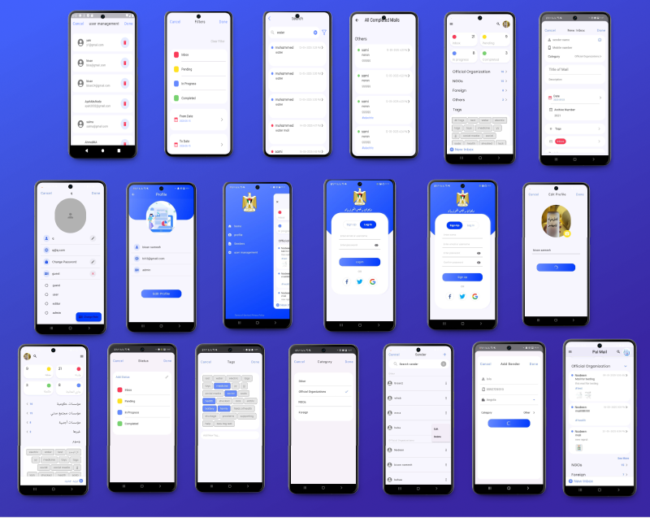

# 📧 PalMail App (Flutter)

A smart and modern mail application built with Flutter, featuring full account management, role-based access, and advanced email organization with a clean and scalable architecture.

## 📸 App Mockup

Here's a preview of the app UI on mobile devices:

## 🚀 Features

### 🔐 Authentication
- User login and registration
- Update password and username
- Role management: switch between user/admin
- Edit user profile information

### ✉️ Email Management
- Add new emails with full details
- View email details in a clean interface
- Categorize emails based on:
  - `Pending`
  - `Inbox`
  - `Category`
  - `Completed`
- Filter emails by status
- add, view tags that associated with tags
- add , delete , update sender related with mail,
- view all mails realated with sender
- View all mails associated with categories
- View all mails associated with status
- Real time: refresh data based on user interaction
- completely integration betwwn front end and backend(Api)
- Responsive UI
  

### ⚙️ Tech Stack
- **Flutter** for cross-platform UI
- **Provider** for efficient state management
- **MVC Architecture** for clean and scalable code structure

### 💡 Key Learnings:
- Professional case management using **Provider**
- Handling errors and different server responses
- Building responsive and professional UIs
- Full integration with back-end APIs
- Secure authentication to protect user data
- Real-time syncing between frontend and backend

  
This project taught me the importance of writing **clean**, **readable**, and **adaptable** code, especially in fast-changing environments where the UI needs to reflect live updates.

> Each small project adds a step for me and brings me closer to the level I aspire to reach. The best thing is that every piece of code I write is a new opportunity to learn and improve myself.

🔗 [Check it on LinkedIn ]([https://lnkd.in/dZyhHrm2](https://www.linkedin.com/feed/update/urn:li:activity:7331405888508850176/))

## 📁 Project Structure

lib/
├── models/         # Data models (email, user, etc.)
├── views/          # UI screens and widgets
├── controllers/    # Business logic and app flow
├── providers/      # State management with Provider
├── core/           # APIs and data handling
└── main.dart       # Entry point

